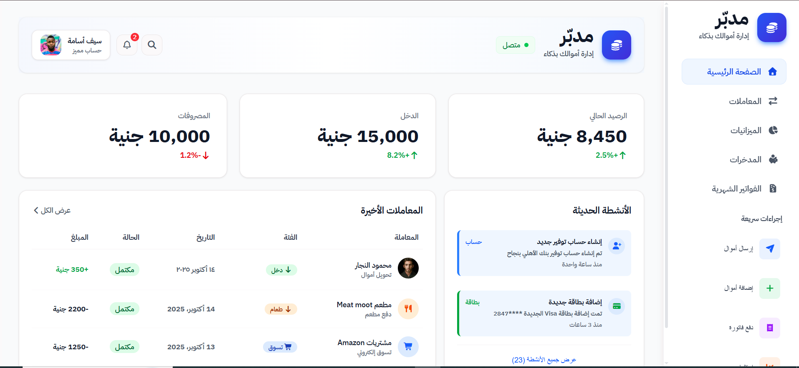

# 💸 Mudabbir - Financial Dashboard

  <b>Modern Financial Dashboard UI</b> 
  Responsive • Clean • Built with HTML & CSS

  

---

## 📸 Project Preview

---

## ✨ Highlights

- 📊 Dashboard-style layout for financial tracking  
- 📁 Sidebar navigation system  
- 🧾 Organized content with cards & sections  
- 📱 Fully responsive across devices  
- 🎨 Modern UI with gradients & strong visual hierarchy  

---

## 🛠️ Tech Stack

  
  
  

---

## 🎯 What I Learned

- Structuring complex layouts  
- Using Flexbox & Grid effectively  
- Building responsive UI  
- Improving UI/UX decisions  

---

## 🚀 Live Demo

👉 https://nada-mahrous.github.io/Mudabbir-Financial-Dashboard/

---

## 📌 Status

🟢 Completed  
🛠️ Open for improvements  

---

## ⭐ Support

If you like this project, don't forget to give it a ⭐
